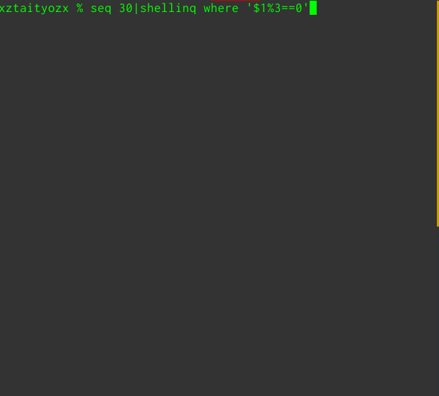
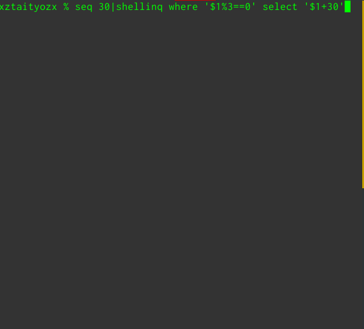
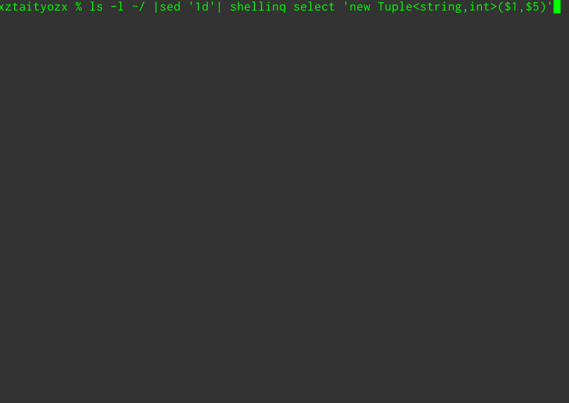

# __<font color='#333333'> Shel</font><font color='#3f72c8'>LINQ</font>__
__ShelLINQ__ is LINQ for Shell.

  


(I am using google translation to write this.)

## __Description__
ShelLINQ is a shell command that allows you to use LINQ provided by .NET framework with Bash and others. it can filter data passed from standard input and pipe data using queries such as LINQ.

## __Usage__
```sh
shellinq [TYPEs] [method query] ... [-o [FORMAT]]
```
`[TYPEs]` is the type of input data.  
For int type, specify `[int]`. If not specified, ShelLINQ expects from `int`, `double`, or `string`.  
If there are multiple columns like the `ls -l` command, specify them in the order of `[type1, type2, ..., typeN]`. If you do not specify it, ShelLINQ forecasts it all.  

`[method query]` is the query part.  
For `[methond]`, specify the method name provided by LINQ like `Select` or `Where`. 
`[query]` is an argument part to be given to the method.  
For example, 
```cs
Where (x => x% 2 == 0)
```
writes
```sh
where 'x => x% 2 == 0'.
```
In `[query]`, you can use `$` for column specification like `awk`.  
For example if you write `where '$ 1% 2 == 0'` ShelLINQ interprets `where '_ => _% 2 == 0'`.  
With `$0` all columns can be specified.

`[-o [FORMAT]]` is used to specify the output format with C # code.
Specifically, it specifies the block part of the foreach loop using the processed data. Since the retrieved item is stored in the variable item it is a good idea to use it.
For example,  
Input
```sh
% seq 30|shellinq select '$1%2==0' -o 'Console.WriteLine(item?"even":"odd");'
```
output
```sh
odd
even
odd
even
.
.
.
```

## __Demo__






## __Install__
```sh
git clone https://github.com/xztaityozx/shellinq
./shellinq/install.sh
```

## __Requierment__
mcs  
mono

## __説明__

## __使い方__
```sh
shellinq [TYPEs] [method query] ... [-o [FORMAT]]
```
`[TYPEs]`は入力データの型です。int型の場合は`[int]`と指定します。指定しない場合は`int`,`double`,`string`のどれかからShelLINQが予想します。  
`ls -l`コマンドのように複数のカラムがある場合は`[type1,type2,...,typeN]`というように順番に指定します。これも指定しない場合はShelLINQがすべて予想します。

`[method query]`はクエリ部分です。`method`には`Select`や`Where`のようにLINQが提供するメソッド名を指定します。Qにはメソッドに与える引数部分を指定します。  
例えば
```cs
Where (x => x% 2 == 0)
```
は
```sh
where 'x => x% 2 == 0'.
```
と書きます。  
`query`ではawkのようにカラムの指定に$が使えます。  
例えば`where '$1%2==0'`と書けばShelLINQは`where '_=>_%2==0'`と解釈します。  
`$0`を使うとすべてのカラムが指定できます。

`[-o [FORMAT]]`は出力フォーマットをC#のコードで指定するときに使います。
具体的には処理されたデータを使った`foreach`ループのブロック部を指定します。  
取り出されたアイテムは変数`item`に格納されているのでそれを使用するといいでしょう。  
例  
Input
```sh
% seq 30|shellinq select '$1%2==0' -o 'Console.WriteLine(item?"even":"odd");'
```
output
```sh
odd
even
odd
even
.
.
.
```

## __インストール__
```sh
git clone https://github.com/xztaityozx/shellinq
./shellinq/install.sh
```

## __必要なもの__
`mono`と`mcs`が必要です